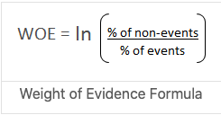
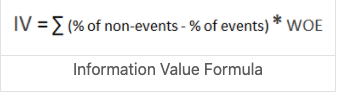
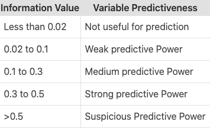

```{r, include=FALSE, echo=FALSE, message=FALSE}
#Downloading the required packages
library(dplyr)
library(readr)
library(plyr)
library(gmodels)
library(ggplot2)
library(ggpubr)
library(pdp)
library(klaR)
library(Information)
library(gridExtra)
library(kableExtra)
library(knitr)
library(glmnet)
library(tidyverse)
library(caret)
library(pROC)
library(data.table)
library(scales)
library(openxlsx)
library(png)
library(knitr)
library(kableExtra)
library(broom)
```

```{r, include=FALSE, echo=FALSE, message=FALSE}
german_credit<-read_delim("http://archive.ics.uci.edu/ml/machine-learning-databases/statlog/german/german.data",delim = " ",col_names = FALSE)
headers=c("Status_checking_account","Duration_in_month","Credit_history",
          "Purpose","Credit_amount","Savings_account_bonds","Present_employment_since",
          "Installment_rate_in_percentage_of_disp_income","Personal_status_and_sex",
          "Guarantors","Present_residence_since","Property","Age",
          "Other_installment_plans","Housing","Number_of_existing_credits_at_this_bank",
          "Job","Number_of_dependants","Telephone","foreign_worker","Credit_Risk")
colnames(german_credit)<-headers
#gdat<-german_credit
```

```{r, include=FALSE, echo=FALSE, message=FALSE}
gdat<-german_credit
gdat$Status_checking_account<-factor(mapvalues(gdat$Status_checking_account,c("A11","A12","A13","A14"),c("lt_0","lt_200","gte_200","No_account")),
                                     levels =c("No_account","lt_0","lt_200","gte_200"))
gdat$Credit_history<-factor(mapvalues(gdat$Credit_history,c("A30","A31","A32","A33","A34"),c("No_credit_due","All_paid_duly","All_existing_paid_duly","delayed_in_past","Critical")),
                            levels = c("Critical","delayed_in_past","No_credit_due","All_paid_duly","All_existing_paid_duly"))
gdat$Purpose<-factor(mapvalues(gdat$Purpose,c("A40","A41","A42","A43","A44","A45","A46","A47","A48","A49","A410"),c("New.car", "Used.car", "Furniture", "Television", "Appliances", "Repairs", "Education", "Vacation", "Retraining", "Business", "Others")))

gdat$Savings_account_bonds<-factor(mapvalues(gdat$Savings_account_bonds,c("A61","A62","A63","A64","A65"),c("lt_100","100_500","500_1000","gt_1000","No_savings")),
                                   levels=c("No_savings","lt_100","100_500","500_1000","gt_1000"))

gdat$Present_employment_since<-factor(mapvalues(gdat$Present_employment_since,c("A71","A72","A73","A74","A75"),c("Unemployed","1_yr","4_yr","7_yr","gt_7_yr")),
                                      levels=c("Unemployed","1_yr","4_yr","7_yr","gt_7_yr"))

gdat$Personal_status_and_sex<-factor(mapvalues(gdat$Personal_status_and_sex,c("A91","A92","A93","A94","A95"),c("Male.divorced","Female.divorced","male.single","male.married","female.single")),
                                     levels=c("female.single","Male.divorced","Female.divorced","male.single","male.married"))

gdat$Guarantors<-factor(mapvalues(gdat$Guarantors,c("A101","A102","A103"),c("none","co_applicant","guarantor")),levels=c("none","co_applicant","guarantor"))

gdat$Property<-factor(mapvalues(gdat$Property,c("A121","A122","A123","A124"),c("Real.estate","insurance","car","No.property")),levels=c("No.property","Real.estate","insurance","car"))

gdat$Other_installment_plans<-factor(mapvalues(gdat$Other_installment_plans,c("A141","A142","A143"),c("banks","stores","None")),levels=c("None","banks","stores"))

gdat$Housing<-factor(mapvalues(gdat$Housing,c("A151","A152","A153"),c("Rent","Own","Free")),levels =c("Free","Rent","Own"))

gdat$Job<-factor(mapvalues(gdat$Job,c("A171","A172","A173","A174"),c("Unemployed_NonRes","Unskilled_Res","skilled","management")),
                 levels=c("Unemployed_NonRes","Unskilled_Res","skilled","management"))

gdat$Telephone<-factor(mapvalues(gdat$Telephone,c("A191","A192"),c("No","Yes")))

gdat$foreign_worker<-factor(mapvalues(gdat$foreign_worker,c("A201","A202"),c("Yes","No")))

gdat$Number_of_dependants<-factor(mapvalues(gdat$Number_of_dependants,c(2,1),c("lt_2","gt_2")),levels=c("lt_2","gt_2"))

gdat$Installment_rate_in_percentage_of_disp_income<-factor(mapvalues(gdat$Installment_rate_in_percentage_of_disp_income,c(4,3,2,1),c("0_20","20_25","25_35","35_plus")),
                                                           levels =c("0_20","20_25","25_35","35_plus"))

gdat$Present_residence_since <-factor(mapvalues(gdat$Present_residence_since ,c("1","2","3","4"),c("lt_1_yr","1_4yr","4_7yr","gt_7_yr")),levels =c("lt_1_yr","1_4yr","4_7yr","gt_7_yr"))

gdat$Credit_Risk<-factor(mapvalues(gdat$Credit_Risk,c(2,1),c("Bad","Good")))

```


### Weight of evidence
Weight of evidence indicates the predictive power of an independent variable in relation to the dependent variable. It evolved from credit scoring world and is a measure of separating good and bad customers. 
\
{width=25%}
\
\

### Information value 
Information value is one of the most useful technique to select important variables in a predictive model. It helps to rank variables on the basis of their importance. 
\
{width=25%}
\
\
The table below shows information value range and the variable's predictiveness
\
\
{width=25%}

\
\

The table below shows Information value summary for credit risk data. Let's look at WOE for the top 9 variables from this table.
\
```{r, include=TRUE,message=FALSE,echo=FALSE}
gdat_IV <- as.data.frame(gdat)
#detach(gdat)
gdat_IV$Credit_Risk <- factor(mapvalues(gdat_IV$Credit_Risk,c("Good","Bad"),c(0,1)),levels =c(0,1)) 
gdat_IV$Credit_Risk <- as.numeric(as.character(gdat_IV$Credit_Risk))
IV <- create_infotables(data=gdat_IV,
                   valid=NULL,
                   y="Credit_Risk")
options("scipen"=100, "digits"=4)
knitr::kable(as.data.frame(IV$Summary), row.names=FALSE)%>%
  kable_paper("hover", full_width = F,html_font = "Cambria",bootstrap_options = "striped",fixed_thead = T) %>%
  add_indent(c(1:20))
#print(IV$Summary)
#colnames(gdat) <- make.names(colnames(gdat))
#woemodel <- woe(Credit_Risk~., data = gdat, zeroadj=0.5, applyontrain = TRUE)
#print(woemodel)
#plot(woemodel)
#plot(woemodel, type = "IV")

```

\
Plots show WOE for top 9 variables (based on the IV)
\
```{r, include=TRUE,message=FALSE,echo=FALSE}
MultiPlot(IV, IV$Summary$Variable[1:9])
```
\
Tables show WOE for top 9 variables (based on the IV)
\
```{r,include=TRUE,message=FALSE,echo=FALSE,results='asis'}
Imp <- IV$Summary$Variable[1:9]

for (i in Imp) {
  #print(paste0("WOE for ",i))
  cat('\n')
  #print(knitr::kable(as.data.frame(IV$Tables[i][[1]]),row.names = FALSE,"pipe"))
  print(knitr::kable(as.data.frame(IV$Tables[i][[1]]),row.names = FALSE)%>%
  kable_paper("hover", full_width = F,html_font = "Cambria",bootstrap_options = "striped",fixed_thead = T))
  cat('\n')
}
#grid.table(IV$Tables)
```

